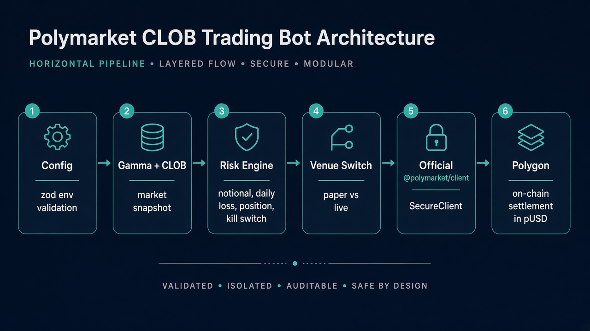
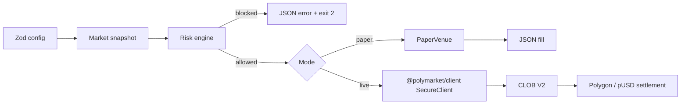
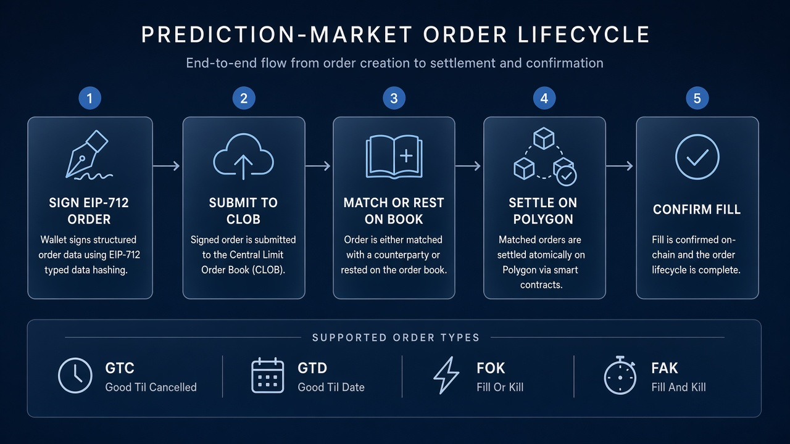
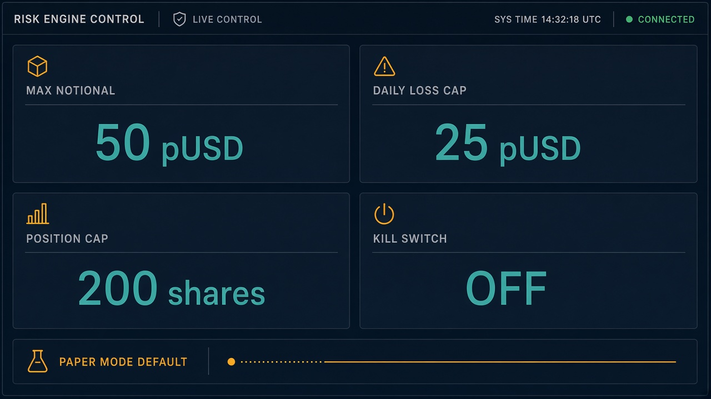

# Polymarket Trading Bot

<p align="center">
  
</p>

<p align="center">
  <strong>Paper-first execution service for Polymarket CLOB V2.</strong><br />
  Risk-gated market orders, official TypeScript SDK, pUSD settlement on Polygon.
</p>

<p align="center">
  
  
  
  
  
</p>

Execution service for [Polymarket](https://polymarket.com) CLOB markets. The default path is **paper trading**. Live orders go through the official [`@polymarket/client`](https://docs.polymarket.com/getting-started/typescript) SDK, behind hard risk limits.

This repository is part of the [antonkarasbiz](https://github.com/antonkarasbiz) prediction-market stack.

---

## Why this exists

Polymarket is a hybrid CLOB: orders are matched off-chain and settled on-chain. After the **CLOB V2 cutover on 28 April 2026**, production no longer accepts V1-signed orders. Collateral is **pUSD** (Polymarket USD), a 6-decimal ERC-20 on Polygon backed 1:1 by USDC.

A production bot cannot treat that as a thin `POST /order` wrapper. It has to:

1. Discover a market from Gamma / official client.
2. Read a live book (bid, ask, mid, tick, min size).
3. Price a marketable order without blowing through depth.
4. Refuse the order if risk limits fail.
5. Sign with EIP-712, authenticate with L2 HMAC, and wait for `MATCHED → MINED → CONFIRMED`.

This repo implements that control plane. Strategy research lives in [`polymarket-analytics`](https://github.com/antonkarasbiz/polymarket-analytics). Quoting lives in [`polymarket-market-maker`](https://github.com/antonkarasbiz/polymarket-market-maker).

---

## Venue snapshot — 10 September 2026

Pulled live from Polymarket public APIs while this README was written. Numbers move every trade; treat them as a dated snapshot, not a forecast.

| Source | Metric | Value |
| --- | --- | --- |
| [`data-api.polymarket.com/oi`](https://data-api.polymarket.com/oi) | Global open interest | **$358.31M** |
| [DeFi Rate volume series](https://defirate.com/prediction-markets/volume/polymarket/) (through 25 Aug 2026) | 2026 YTD notional | **$56.64B** |
| Same series | August 2026 monthly volume | **$2.58B** |
| [Kairos venue tape](https://kairos.trade/data) | Polymarket 24h / 7d volume (recent print) | **~$47M / ~$204M** |
| Official docs | CLOB host | `https://clob.polymarket.com` |
| Official docs | Market discovery | `https://gamma-api.polymarket.com` |

### Active books the bot can target

Images and prices come from the [Gamma API](https://gamma-api.polymarket.com/markets?limit=5&active=true&closed=false&order=volume24hr&ascending=false) and official Polymarket OG cards.

<p align="center">
  <a href="https://polymarket.com/event/fed-decision-in-september-762">
    
  </a>
</p>

| Market | Yes / No | 24h volume | Liquidity | Tick / min size | Event card |
| --- | ---: | ---: | ---: | ---: | --- |
| [Fed +25 bps after Sept 2026 FOMC](https://polymarket.com/event/fed-decision-in-september-762) | **65.5¢ / 34.5¢** | $1.78M | $576k | 1¢ / 5 shares |  |
| [No change after Sept 2026 FOMC](https://polymarket.com/event/fed-decision-in-september-762) | **33.5¢ / 66.5¢** | $1.55M | $620k | 1¢ / 5 shares |  |
| [Como 1907 win vs RB Leipzig (UCL)](https://polymarket.com/event/ucl-com-rbl-2026-09-10) | **99.95¢ / 0.05¢** | $850k | $573k | 0.1¢ / 5 shares |  |
| [Spanberger wins 2028 Dem nomination](https://polymarket.com/event/democratic-presidential-nominee-2028) | **0.15¢ / 99.85¢** | $1.65M | $403k | 0.1¢ / 5 shares |  |

Parent event **Fed Decision in September** was printing **$113.9M** lifetime volume, **$26.1M** open interest, and **$5.12M** in the last 24 hours. The 2028 Democratic nominee event was above **$1.27B** lifetime volume with **$78.6M** of resting liquidity.

<p align="center">
  
  &nbsp;&nbsp;
  
  &nbsp;&nbsp;
  
</p>

Prices on Polymarket **are probabilities**. A 65.5¢ Yes bid on the +25 bps FOMC contract is the book's implied 65.5% chance of that outcome. You do not trade the midpoint: buys lift the ask, sells hit the bid.

---

## Architecture

<p align="center">
  
</p>



| Layer | Module | Responsibility |
| --- | --- | --- |
| Config | `src/config.ts` | Environment-validated limits and mode. Live mode refuses to start without wallet + signer. |
| Risk | `src/risk.ts` | Kill switch, daily loss, notional cap, position-share cap. First reject wins. |
| Venue | `src/execution.ts` | `PaperVenue` simulates a 51¢ mid. `createLiveVenue()` uses `createSecureClient` + `placeMarketOrder`. |
| CLI | `src/index.ts` | One JSON object per run. Secrets are never logged. |

Live authentication follows the official quickstart: wallet address + signer via `createSecureClient`, then `fetchMarket` / `placeMarketOrder`. See [Place your first order](https://docs.polymarket.com/trading/quickstart) and [Wallets and authentication](https://docs.polymarket.com/trading/wallets-auth).

---

## How Polymarket actually fills an order

<p align="center">
  
</p>

Official lifecycle from [Order lifecycle](https://docs.polymarket.com/concepts/order-lifecycle) and [Prices & order book](https://docs.polymarket.com/concepts/prices-orderbook):

1. **Sign** an EIP-712 order (`tokenId`, side, price, size, millisecond timestamp). V2 domain version is `"2"`.
2. **Submit** to the CLOB operator at `https://clob.polymarket.com`. Operator checks signature, pUSD/token balance, allowances, and tick size.
3. **Match or rest.** A "market order" is a limit priced to cross the book immediately. Selected crypto/finance up-down books apply a **250 ms taker delay**. Sports books can apply a game delay. Pending delayed orders cannot be cancelled.
4. **Settle** on Polygon. The Exchange contract moves outcome tokens one way and pUSD the other. Settlement is atomic.
5. **Confirm.** Trade states: `MATCHED → MINED → CONFIRMED` (or `RETRYING` / `FAILED`).

| Order type | Behavior | When this bot uses it |
| --- | --- | --- |
| **FAK** | Fill what you can, cancel the rest | Live market buy (`placeMarketOrder`) |
| **FOK** | Fill entirely or kill | All-or-nothing clips |
| **GTC** | Rest until filled or cancelled | Maker quotes (see market-maker repo) |
| **GTD** | Rest until a timestamp | Session-bounded working orders |
| **Post-only** | Reject if it would take | Spread capture only |

Auth is two-layer ([API docs](https://docs.polymarket.com/getting-started/api)):

| Layer | Mechanism | Used for |
| --- | --- | --- |
| L1 | Wallet EIP-712 signature | Create / derive API credentials |
| L2 | HMAC-SHA256 over `timestamp + METHOD + path + body` | Place, cancel, and read private account data |

---

## Risk defaults

<p align="center">
  
</p>

Defaults are conservative on purpose. Change them in `.env`, not in code.

| Control | Env | Default | What it stops |
| --- | --- | --- | --- |
| Mode | `POLYMARKET_MODE` | `paper` | Accidental live sends |
| Max notional | `MAX_NOTIONAL_PUSD` | **50 pUSD** | Oversized clips vs book depth |
| Max daily loss | `MAX_DAILY_LOSS_PUSD` | **25 pUSD** | Runaway sessions |
| Max position | `MAX_POSITION_SHARES` | **200 shares** | Inventory blow-ups |
| Kill switch | `KILL_SWITCH` | `false` | Instant halt without a deploy |

Worked example against the live FOMC +25 bps book (ask **66¢**, min size 5):

| Intent | Notional | Shares @ 66¢ | Risk result |
| --- | ---: | ---: | --- |
| Starter clip in `src/index.ts` | 10 pUSD | ~15.2 | Allowed |
| Default notional ceiling | 50 pUSD | ~75.8 | Allowed |
| One share over the cap | 133 pUSD | 201 | `position cap exceeded` |
| After −25 pUSD realized PnL | any | any | `daily loss limit reached` |
| `KILL_SWITCH=true` | any | any | `kill switch is enabled` |

Fee context from the [official fee schedule](https://docs.polymarket.com/trading/fees). Makers pay **0**. Takers pay `C × feeRate × p × (1 − p)`. Geopolitics is fee-free.

| Category | Taker rate | Peak fee on 100 shares @ 50¢ |
| --- | ---: | ---: |
| Crypto | 0.07 | $1.75 |
| Sports / economics / culture / weather | 0.05 | $1.25 |
| Finance / politics / tech / mentions | 0.04 | $1.00 |
| Geopolitics | 0 | $0.00 |

On a 10 pUSD starter buy of the FOMC +25 bps Yes at 66¢ (~15.15 shares, economics schedule 0.05):

```text
fee ≈ 15.15 × 0.05 × 0.66 × 0.34 ≈ 0.17 pUSD
```

That is why the bot sizes notional **before** fees and keeps paper mode as the default.

---

## Stack map

| Surface | URL / package | Role in this bot |
| --- | --- | --- |
| Official TypeScript SDK | [`@polymarket/client`](https://www.npmjs.com/package/@polymarket/client) | `createSecureClient`, `fetchMarket`, `placeMarketOrder` |
| CLOB V2 | `https://clob.polymarket.com` | Books, midpoints, signed order entry |
| Gamma | `https://gamma-api.polymarket.com` | Slugs, images, 24h volume, tick, min size |
| Data API | `https://data-api.polymarket.com` | Open interest, positions, public trades |
| Collateral | pUSD on Polygon, 6 decimals | All buys debit pUSD; winning shares redeem $1 |
| Onramp | `CollateralOnramp.wrap()` `0x93070a847efEf7F70739046A929D47a521F5B8ee` | USDC.e → pUSD for API-only wallets |
| Schema | `zod` | Fail closed on bad env |

CLOB V1 (`@polymarket/clob-client`, USDC.e, EIP-712 version `"1"`) is **not supported**. See [Migrating to CLOB V2](https://docs.polymarket.com/v2-migration).

---

## Setup

```bash
git clone https://github.com/antonkarasbiz/polymarket-trading-bot.git
cd polymarket-trading-bot
npm install
cp .env.example .env
```

Minimum `.env` for paper:

```dotenv
POLYMARKET_MODE=paper
POLYMARKET_MARKET_SLUG=will-the-fed-increase-interest-rates-by-25-bps-after-the-september-2026-meeting-649
MAX_NOTIONAL_PUSD=50
MAX_DAILY_LOSS_PUSD=25
MAX_POSITION_SHARES=200
KILL_SWITCH=false
```

```bash
npm run paper
npm test
```

Live mode is opt-in and requires a funded Polymarket wallet plus pUSD allowance on the V2 Exchange. Do not commit keys.

```dotenv
POLYMARKET_MODE=live
POLYMARKET_WALLET_ADDRESS=0x...
POLYMARKET_PRIVATE_KEY=0x...
```

```bash
npm run check
npm run dev
```

### Expected paper output

```json
{
  "ok": true,
  "mode": "paper",
  "market": "will-the-fed-increase-interest-rates-by-25-bps-after-the-september-2026-meeting-649",
  "fill": {
    "orderId": "paper-1778000000000",
    "side": "BUY",
    "notional": 10,
    "shares": 19.6078,
    "price": 0.51,
    "paper": true
  }
}
```

A blocked order exits `2` and prints only the reason:

```json
{ "ok": false, "reason": "kill switch is enabled", "market": "…" }
```

---

## Project layout

```text
src/
  index.ts         load config → snapshot → risk → one order → JSON
  config.ts        zod env schema
  risk.ts          hard limits
  risk.test.ts     kill switch, loss, notional, inventory
  execution.ts     PaperVenue + live SecureClient adapter
```

---

## Related repositories

| Repo | Job |
| --- | --- |
| [polymarket-market-maker](https://github.com/antonkarasbiz/polymarket-market-maker) | Two-sided quotes, post-only, rebate-aware spreads |
| [polymarket-analytics](https://github.com/antonkarasbiz/polymarket-analytics) | Signals from Gamma / Data API / price history |
| [evm-order-router](https://github.com/antonkarasbiz/evm-order-router) | Venue selection and revert-safe EVM simulation |
| [solana-execution-engine](https://github.com/antonkarasbiz/solana-execution-engine) | Solana-side routing for the same risk model |

---

## Sources

- [Polymarket docs](https://docs.polymarket.com) — CLOB V2, pUSD, fees, order lifecycle, TypeScript SDK
- [Polymarket TypeScript SDK](https://docs.polymarket.com/getting-started/typescript)
- [CLOB V2 migration](https://docs.polymarket.com/v2-migration)
- [Gamma markets](https://gamma-api.polymarket.com/markets?limit=5&active=true&closed=false&order=volume24hr&ascending=false) — snapshot 10 Sep 2026
- [Global open interest](https://data-api.polymarket.com/oi) — snapshot 10 Sep 2026
- [DeFi Rate Polymarket volume](https://defirate.com/prediction-markets/volume/polymarket/)
- Market images and OG cards are official Polymarket assets (`polymarket.com`, `polymarket-upload.s3.us-east-2.amazonaws.com`)

---

## License

MIT. Trading can result in total loss of capital. This repository is software, not financial advice.
